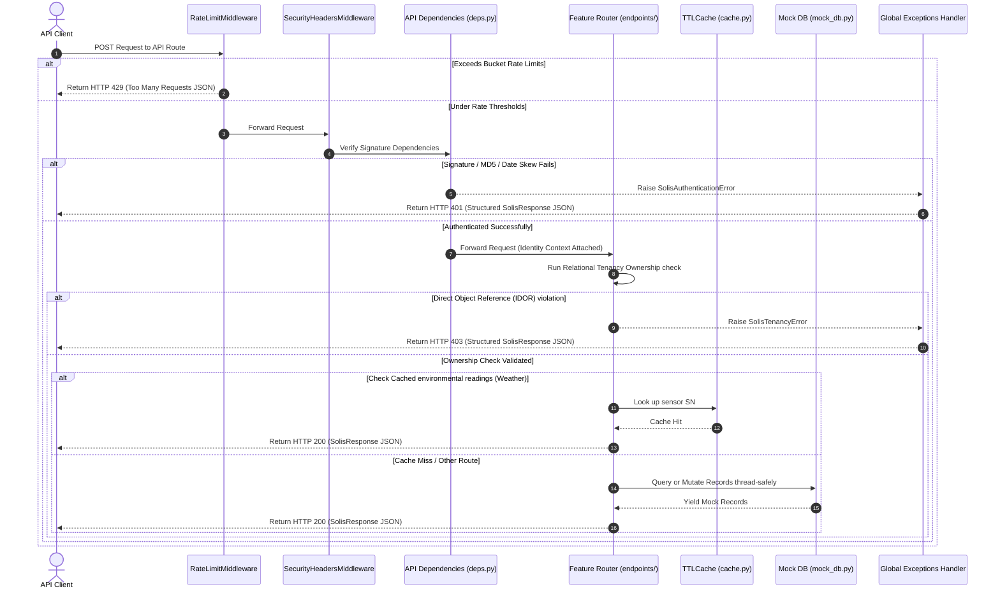
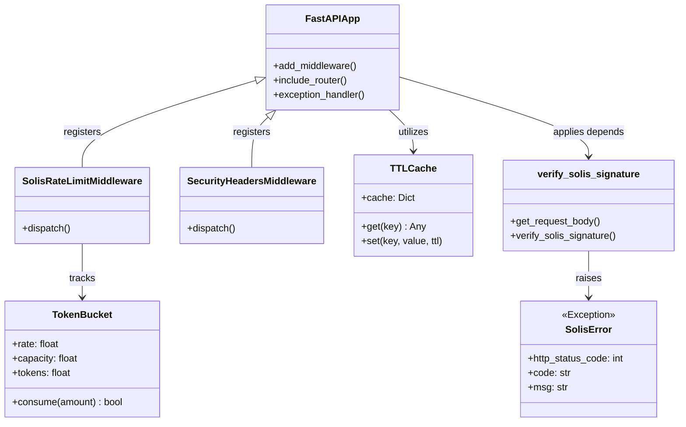

# Production-Grade SolisCloud Platform API System (V2.0)

Welcome to the enterprise-grade **Mock SolisCloud Platform API System**. This system provides a secure, high-performance, modular simulation of the **Ginlong (Solis) Technologies SolisCloud Platform API V2.0**, fully compliant with production specifications.

---

## 🏗️ System Architecture & Directory Design

The codebase utilizes a highly structured, layered Python package architecture. Each component is decoupled into functional layers under the `app/` namespace to enforce strict separation of concerns, facilitate maintainability, and allow clean testing.

### Modular Project Layout

```text
g:\SolisCloud-MockAPI-System\
│
├── app/
│   ├── __init__.py            # Marks app as a Python package
│   │
│   ├── core/                  # Configurations, custom middlewares & system logs
│   │   ├── __init__.py
│   │   ├── config.py         # Masked credential settings manager
│   │   ├── exceptions.py     # Solis-specific semantic business exceptions
│   │   ├── logging.py        # Masked structured stdout logging formatter
│   │   └── middleware.py     # Token-bucket Rate Limiter & Security headers
│   │
│   ├── database/              # Storage simulations & thread-safe caching layers
│   │   ├── __init__.py
│   │   ├── mock_db.py        # In-memory database tables (STATIONS, INVERTERS...)
│   │   └── cache.py          # Thread-safe TTLCache (environmental readings)
│   │
│   ├── models/                # Pydantic V2 Request & Response schemas
│   │   ├── __init__.py
│   │   ├── base.py           # SolisResponse base generic wrapper
│   │   ├── inverters.py      # Inverter payload models & page sanitizers
│   │   ├── collectors.py     # Collector payload request models
│   │   ├── stations.py       # Station / Plant payload request models
│   │   └── epms.py           # EPM request payload models
│   │
│   ├── api/                   # Router registrations & dependencies
│   │   ├── __init__.py
│   │   ├── deps.py           # verify_solis_signature dependency hook
│   │   └── endpoints/        # Feature-specific router controllers
│   │       ├── __init__.py
│   │       ├── diagnostics.py# Root diagnostic checks
│   │       ├── inverters.py  # Inverter and Alarm routing endpoints
│   │       ├── collectors.py # Collector routing endpoints
│   │       ├── epms.py       # EPM routing endpoints
│   │       ├── weather.py    # Meteorological environmental routing
│   │       └── stations.py   # Station/Plant routing endpoints
│   │
│   └── main.py                # App configuration, middleware injection, and router mounts
│
├── main.py                   # Clean root ASGI entrypoint (uvicorn target)
├── test_client.py            # Automated integration verification client
├── requirements.txt          # Python package requirements
└── README.md                 # System Design & API Reference Manual
```

---

## 📊 System Design Diagrams

The following system design diagrams illustrate how requests traverse our layered structure, showing the sequential security checks, transaction execution, cache hits, database queries, and structured error formatting.

### 1. Request Processing Lifecycle Pipeline



### 2. Component Class Diagram



---

## 🛡️ Core Security Architecture & Guards

The system implements strict production-grade security filters to safeguard simulated resources under heavy load:

1. **Timing Attack Protection:** Cryptographic signatures use `hmac.compare_digest` for secure, constant-time validation rather than default string equality `==` operator.
2. **DDoS Protection Rate Limiting:** A custom, thread-safe token-bucket rate limiter middleware caps inverter endpoints at **2 requests/sec** and other endpoints at **10 requests/sec** per parsed `api_id` identifier.
3. **Structured Logging Formatter:** Structured stdout logs format all traces cleanly (`[TIMESTAMP] [LEVEL] [MODULE] - MESSAGE`), automatically masking sensitive headers and API secrets.
4. **Relational IDOR Tenancy Verification:** Dynamic lookup verification prevents direct object referencing. A request for station, inverter, collector, epm, or weather sensor checks if the authenticated `api_id` actually owns the resource.
5. **Payload Bounds Sanitization:** Enforces strict bounds (`1 <= pageSize <= 100`) and max string lengths under Pydantic models to defend against buffer exhaustion.
6. **Global Exception Handlers:** Catch authentications, validations, tenancy violations, and internal HTTP errors, mapping them cleanly to a unified `SolisResponse` contract.

---

## 📖 Complete API Reference Documentation

All endpoints require a `POST` method, UTF-8 encoded `application/json` Content-Type, and Solis GMT signature headers. They return standard wrapped structures.

### Summary of Supported API Interfaces

| Category | API Interface | Method | Endpoint URL | Rate Limit | Primary Protection Guard |
| :--- | :--- | :---: | :--- | :---: | :--- |
| **Diagnostics** | Diagnostic Healthcheck | `GET` | `/` | None | Open diagnostic endpoint |
| **Inverters** | Inverter List Under Account | `POST` | `/v1/api/inverterList` | 2 req/sec | Relational Tenancy Filter & Page Bounds Sanitization |
| **Inverters** | Single Inverter Details | `POST` | `/v1/api/inverterDetail` | 2 req/sec | Inverter SN Tenancy Ownership Verification |
| **Inverters** | Multiple Inverters Details | `POST` | `/v1/api/inverterDetailList` | 2 req/sec | Dynamic Tenancy Isolation |
| **Inverters** | Inverter Real-Time Day | `POST` | `/v1/api/inverterDay` | 2 req/sec | Inverter SN Tenancy Ownership Verification |
| **Inverters** | Inverter Daily Month Totals | `POST` | `/v1/api/inverterMonth` | 2 req/sec | Inverter SN Tenancy Ownership Verification |
| **Inverters** | Inverter Monthly Year Totals | `POST` | `/v1/api/inverterYear` | 2 req/sec | Inverter SN Tenancy Ownership Verification |
| **Inverters** | Inverter Annual Totals | `POST` | `/v1/api/inverterAll` | 2 req/sec | Inverter SN Tenancy Ownership Verification |
| **Inverters** | Inverters Quality Assurance | `POST` | `/v1/api/inverter/shelfTime` | 2 req/sec | Relational Tenancy Filter |
| **Inverters** | Device Alarm List Under Account | `POST` | `/v1/api/alarmList` | 2 req/sec | Relational Tenancy Filter |
| **Collectors** | Collector List Under Account | `POST` | `/v1/api/collectorList` | 2 req/sec | Relational Tenancy Filter & Page Sanitization |
| **Collectors** | Single Collector Details | `POST` | `/v1/api/collectorDetail` | 2 req/sec | Collector SN Tenancy Ownership Verification |
| **Collectors** | Collector Signal Day Timeline | `POST` | `/v1/api/collector/day` | 2 req/sec | Collector SN Tenancy Ownership Verification |
| **EPMs** | EPM List Under Account | `POST` | `/v1/api/epmList` | 2 req/sec | Relational Tenancy Filter & Page Sanitization |
| **EPMs** | Single EPM Details | `POST` | `/v1/api/epmDetail` | 2 req/sec | EPM SN Tenancy Ownership Verification |
| **EPMs** | EPM Real-Time Day Timeline | `POST` | `/v1/api/epm/day` | 2 req/sec | EPM SN Tenancy Ownership Verification |
| **Weather** | Meteorological Instruments List | `POST` | `/v1/api/weatherList` | 10 req/sec | Relational Tenancy Filter |
| **Weather** | Single Meteorological Instrument | `POST` | `/v1/api/weatherDetail` | 10 req/sec | Weather SN Tenancy Ownership & TTLCache Optimization |
| **Stations** | Power Stations List Under Account | `POST` | `/v1/api/userStationList` | 10 req/sec | Relational Tenancy Filter & Page Sanitization |
| **Stations** | Single Power Station Details | `POST` | `/v1/api/stationDetail` | 10 req/sec | Station ID / NMI Tenancy Ownership Verification |
| **Stations** | Multiple Power Stations Details | `POST` | `/v1/api/stationDetailList` | 10 req/sec | Dynamic Tenancy Isolation |
| **Stations** | Station Real-Time Day Timeline | `POST` | `/v1/api/stationDay` | 10 req/sec | Station ID / NMI Tenancy Ownership Verification |
| **Stations** | Create a New Power Station | `POST` | `/v1/api/addStation` | 10 req/sec | Thread-safe insert & Dynamic relational registration |
| **Stations** | Modify Power Station Information | `POST` | `/v1/api/stationUpdate` | 10 req/sec | Station ID Tenancy Ownership Verification |
| **Stations** | Bind a New Collector to Station | `POST` | `/v1/api/addStationBindCollector` | 10 req/sec | Associated NMI Tenancy Ownership Verification |
| **Stations** | Unbind Collector from Station | `POST` | `/v1/api/delCollector` | 10 req/sec | Collector SN Tenancy Ownership Verification |
| **Stations** | Bind Inverter to Power Plant | `POST` | `/v1/api/addDevice` | 10 req/sec | Station ID / NMI Tenancy Ownership Verification |

### 1. Root Diagnostics Router (Prefix: `/`)

#### Obtain Mock Diagnostic Health
* **URL:** `GET /`
* **Auth Required:** No
* **Request:** None
* **Response Example:**
  ```json
  {
    "status": "online",
    "system": "Production-Grade SolisCloud Platform API Mock System",
    "version": "2.0.0",
    "documentation": "/docs"
  }
  ```

---

### 2. Inverter & Alarm Router (Prefix: `/v1/api`)

#### 3.1 Obtain Inverter List Under Account
* **URL:** `/v1/api/inverterList`
* **Rate Limit:** 2 req/sec
* **Request Body Structure:**
  ```json
  {
    "pageNo": "1",
    "pageSize": "20",
    "stationId": 1298491919448631809,
    "nmiCode": "41028459350"
  }
  ```
* **Validation Limits:** `pageNo` >= 1, `1 <= pageSize <= 100`.
* **IDOR Protection:** Ownership validation on `stationId` and `nmiCode` filters. Yields only inverters belonging to the caller's tenancy.

#### 3.2 Obtain Details of a Single Inverter
* **URL:** `/v1/api/inverterDetail`
* **Rate Limit:** 2 req/sec
* **Request Body Structure:**
  ```json
  {
    "id": 1308675217944611083,
    "sn": "120B40198150131"
  }
  ```
* **IDOR Protection:** Validates caller owns this inverter SN. Returns real-time battery charge, AC voltages, DC string values.

#### 3.3 Obtain Details of Multiple Inverters
* **URL:** `/v1/api/inverterDetailList`
* **Rate Limit:** 2 req/sec
* **Request Body:** None
* **IDOR Protection:** Dynamically isolates list to only inverters belonging to the caller's tenancy.

#### 3.4 Obtain Inverter Day Timelines
* **URL:** `/v1/api/inverterDay`
* **Rate Limit:** 2 req/sec
* **Request Body:**
  ```json
  {
    "sn": "120B40198150131",
    "time": "2023-06-27",
    "money": "CNY",
    "timeZone": 8
  }
  ```

#### 3.5 Obtain Inverter Month Daily Totals
* **URL:** `/v1/api/inverterMonth`
* **Rate Limit:** 2 req/sec
* **Request Body:**
  ```json
  {
    "sn": "120B40198150131",
    "month": "2023-06",
    "money": "CNY"
  }
  ```

#### 3.6 Obtain Inverter Year Monthly Totals
* **URL:** `/v1/api/inverterYear`
* **Rate Limit:** 2 req/sec
* **Request Body:**
  ```json
  {
    "sn": "120B40198150131",
    "year": "2023",
    "money": "CNY"
  }
  ```

#### 3.7 Obtain Inverter Annual Totals
* **URL:** `/v1/api/inverterAll`
* **Rate Limit:** 2 req/sec
* **Request Body:**
  ```json
  {
    "sn": "120B40198150131",
    "money": "CNY"
  }
  ```

#### 3.8 Obtain Quality Assurance Data
* **URL:** `/v1/api/inverter/shelfTime`
* **Rate Limit:** 2 req/sec
* **Request Body:**
  ```json
  {
    "pageNo": "1",
    "pageSize": "10",
    "stationId": 1298491919448631809
  }
  ```

#### 3.9 Obtain Device Alarm List Under Account
* **URL:** `/v1/api/alarmList`
* **Rate Limit:** 2 req/sec
* **Request Body:** None
* **IDOR Protection:** Yields only alerts belonging to the caller's tenancy stations.

---

### 3. Collector Stick Router (Prefix: `/v1/api`)

#### 3.10 Obtain Collector List Under Account
* **URL:** `/v1/api/collectorList`
* **Rate Limit:** 2 req/sec
* **Request Body:**
  ```json
  {
    "pageNo": "1",
    "pageSize": "20",
    "stationId": 1298491919448631809
  }
  ```

#### 3.11 Obtain Details of a Single Collector
* **URL:** `/v1/api/collectorDetail`
* **Rate Limit:** 2 req/sec
* **Request Body:**
  ```json
  {
    "sn": "404314859"
  }
  ```

#### 3.12 Obtain Collector Signal Day Timeline
* **URL:** `/v1/api/collector/day`
* **Rate Limit:** 2 req/sec
* **Request Body:**
  ```json
  {
    "sn": "404314859",
    "searchinfo": "rssi",
    "time": "2023-06-27",
    "timeZone": 8
  }
  ```

---

### 4. Export Power Manager (EPM) Router (Prefix: `/v1/api`)

#### 3.13 Obtain EPM List Under Account
* **URL:** `/v1/api/epmList`
* **Rate Limit:** 2 req/sec
* **Request Body:**
  ```json
  {
    "pageNo": "1",
    "pageSize": "20"
  }
  ```

#### 3.14 Obtain Details of a Single EPM
* **URL:** `/v1/api/epmDetail`
* **Rate Limit:** 2 req/sec
* **Request Body:**
  ```json
  {
    "sn": "00FFC0011557002"
  }
  ```

#### 3.15 Obtain EPM Day Timelines
* **URL:** `/v1/api/epm/day`
* **Rate Limit:** 2 req/sec
* **Request Body:**
  ```json
  {
    "sn": "00FFC0011557002",
    "searchinfo": "u_ac1,e_total_buy",
    "time": "2023-06-27",
    "timeZone": 8
  }
  ```

---

### 5. Weather Monitor Router (Prefix: `/v1/api`)

#### 3.19 Obtain Meteorological Instruments List
* **URL:** `/v1/api/weatherList`
* **Rate Limit:** 10 req/sec
* **Request Body:** None

#### 3.20 Obtain Details of a Single Meteorological Instrument
* **URL:** `/v1/api/weatherDetail`
* **Rate Limit:** 10 req/sec
* **Request Body:**
  ```json
  {
    "sn": "FFC00115570"
  }
  ```
* **Performance optimization:** Integrates a thread-safe TTLCache. Returns cached environmental data for 300 seconds, eliminating database access.

---

### 6. Power Station / Plant Router (Prefix: `/v1/api`)

#### 4.1 Obtain Power Station List Under Account
* **URL:** `/v1/api/userStationList`
* **Rate Limit:** 10 req/sec
* **Request Body:**
  ```json
  {
    "pageNo": 1,
    "pageSize": 10
  }
  ```

#### 4.2 Obtain Details of Individual Power Station
* **URL:** `/v1/api/stationDetail`
* **Rate Limit:** 10 req/sec
* **Request Body:**
  ```json
  {
    "id": 1298491919448631809
  }
  ```

#### 4.3 Obtain Details of Multiple Power Stations
* **URL:** `/v1/api/stationDetailList`
* **Rate Limit:** 10 req/sec
* **Request Body:** None

#### 4.7 Obtain Real-Time Data of a Single Power Station (Day)
* **URL:** `/v1/api/stationDay`
* **Rate Limit:** 10 req/sec
* **Request Body:**
  ```json
  {
    "id": 1298491919448631809,
    "time": "2023-06-27",
    "money": "AUD",
    "timeZone": 10
  }
  ```

#### 4.11 Create a New Power Station
* **URL:** `/v1/api/addStation`
* **Rate Limit:** 10 req/sec
* **Request Body Structure:**
  ```json
  {
    "stationName": "YingZhen Station",
    "capacity": "12.0",
    "money": "AUD",
    "addr": "Aquatic Drive, Forster",
    "price": "1.0",
    "nmiCode": 41028459350
  }
  ```
* **IDOR Protection & Relational registration:** Thread-safe dynamic database insertion which automatically registers the newly generated station ID to the caller's authorized tenant context.

#### 4.12 Modify Power Station Information
* **URL:** `/v1/api/stationUpdate`
* **Rate Limit:** 10 req/sec
* **Request Body:**
  ```json
  {
    "id": 1298491919448631809,
    "stationName": "New Station Name",
    "capacity": "15.0",
    "price": 1.1,
    "addr": "Updated Address"
  }
  ```

#### 4.13 Bind a New Collector to Power Station
* **URL:** `/v1/api/addStationBindCollector`
* **Rate Limit:** 10 req/sec
* **Request Body:**
  ```json
  {
    "sn": "404314859",
    "stationName": "YingZhen Station",
    "capacity": "12.0"
  }
  ```

#### 4.14 Unbind Collector from Power Station
* **URL:** `/v1/api/delCollector`
* **Rate Limit:** 10 req/sec
* **Request Body:**
  ```json
  {
    "sn": "404314859",
    "deleteInvert": 0
  }
  ```

#### 4.15 Bind Inverter to Power Plant
* **URL:** `/v1/api/addDevice`
* **Rate Limit:** 10 req/sec
* **Request Body:**
  ```json
  {
    "sn": "120B40198150131",
    "id": 1298491919448631809
  }
  ```

---

## ⚙️ Project Quickstart & Configuration

### 1. Installation
Install the pinned dependencies:
```bash
pip install -r requirements.txt
```

### 2. Launch the Application
Start the Uvicorn ASGI server pointing at root `main:app`:
```bash
uvicorn main:app --reload --host 127.0.0.1 --port 8000
```

### 3. Automated Integration Tests
Execute the verification suite to run all diagnostic, cryptographic, rate-limiting, and tenancy validations:
```bash
python test_client.py
```